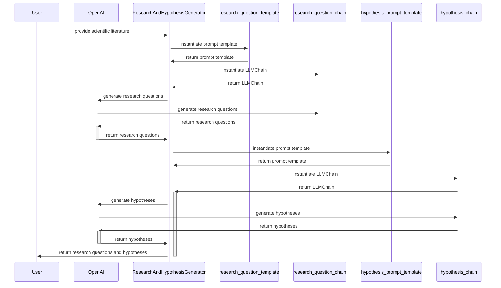

# HypothesisHub
HypothesisHub is an AI Tool for Automated Research Question and Hypothesis Generation from a given Scientific Literature. It applies a chain of thought process to generate research questions and hypotheses from given scientific literature. The tool uses OpenAI and Langchain to generate questions and hypotheses from the given text.

## Features
- Generates research questions from a given scientific literature
- Generates a null hypothesis (H0) and an alternate hypothesis (H1) for each research question
- Handles cases where either H0 or H1 is not present
- Automatically generates missing H1 using the LLMChain if needed
- Negates hypothesis statement if H0 is missing

## Sequence Diagram

## Output

